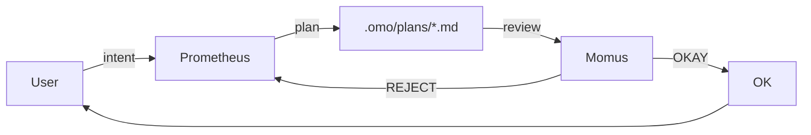
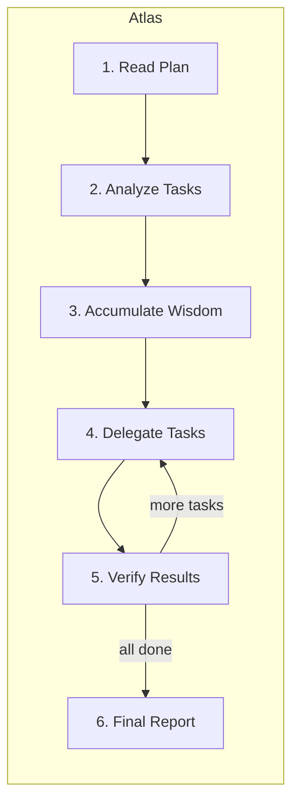

# Orchestration Architecture — Ultrawork

## Three-Layer Architecture

Oh-my-openagent's orchestration system uses a three-layer architecture to solve **context overload**, **cognitive drift**, and **verification gaps** through specialization and delegation.

```
┌─────────────────────────────────────────────────────────────┐
│ PLANNING LAYER (Human + Prometheus)                         │
│                                                             │
│   User ─── intent ──→ Prometheus (Planner)                  │
│                            │                                │
│   Metis (Consultant) ──────┤ catches ambiguities            │
│                            ↓                                │
│                      Plan (.omo/plans/*.md)                 │
│                            │                                │
│   Momus (Reviewer) ←───────┤  OKAY / REJECT                 │
│                                                             │
├─────────────────────────────────────────────────────────────┤
│ EXECUTION LAYER (Orchestrator)                              │
│                                                             │
│   Atlas (Conductor):                                        │
│     1. Read Plan                                            │
│     2. Analyze Tasks                                        │
│     3. Accumulate Wisdom                                    │
│     4. Delegate Tasks                                       │
│     5. Verify Results                                       │
│     6. Final Report                                         │
│                                                             │
├─────────────────────────────────────────────────────────────┤
│ WORKER LAYER (Specialized Agents)                           │
│                                                             │
│   Sisyphus-Junior (Task Executor)                           │
│   Oracle (Architecture Advisor — read-only)                 │
│   Explore (Codebase Pattern Finder)                         │
│   Librarian (Documentation/Dependencies)                    │
│   Multimodal-Looker (Image/PDF Analysis)                    │
│                                                             │
└─────────────────────────────────────────────────────────────┘
```

## Layer 1: Planning Layer

### Prometheus (Planner)
- Interviews the user about their goal
- Researches existing codebase patterns
- Generates a plan file at `.omo/plans/*.md`
- Default model: opus / gpt-5 / glm-5

### Metis (Consultant)
- Runs **before** planning
- Catches ambiguities in user intent ("You said 'add auth' — does that include 2FA?")
- Default model: varies

### Momus (Reviewer)
- Runs **after** plan generation
- Either `OKAY` (passes) or `REJECT`s with feedback
- Default model: opus / gpt-5 / gemini



## Layer 2: Execution Layer (Atlas)

Atlas is **like an orchestra conductor**: it doesn't play instruments, it ensures harmony.



### What Atlas MUST delegate (never do directly):
- Writing or editing code files
- Fixing bugs
- Creating tests
- Git commits

### What Atlas MUST handle directly:
- Reading files
- Searching patterns with grep/glob/ast-grep
- Running tools to query

## Layer 3: Worker Layer (Specialized Subagents)

Atlas calls these via two interfaces:

```js
// 1. delegate_task with category
task({
  category: "deep" | "quick" | "visual-engineering" | "ultrabrain" | "writing" | "git",
  prompt: "..."
})

// 2. omo-specific subagent invocation
call_omo_agent(subagent_type="oracle" | "explore" | "librarian" | "multimodal-looker")
```

### Delegate-Task Categories

| Category | When to use |
|---|---|
| `visual-engineering` | UI/frontend work |
| `artistry` | Creative coding |
| `ultrabrain` | Hard reasoning |
| `deep` | Default for complex tasks |
| `quick` | "Just get it done fast" |
| `quick-rust` | Rust-specific quick fixes |
| `quick-zig` | Zig-specific quick fixes |
| `git` | Git operations |
| `writing` | Documentation/writing |
| `unspecified-low` / `unspecified-high` | Filler for ambiguous tasks |

Defaults are defined in `packages/omo-opencode/src/tools/delegate-task/*-categories.ts` and `packages/omo-opencode/src/shared/model-requirements.ts`. Projects can extend categories via config.

### Subagent Types

| Subagent | Read/Write? | Best for |
|---|---|---|
| `oracle` | Read-only | Architecture advice (cannot write/edit/patch/delegate) |
| `librarian` | Read-only | External docs, dependencies |
| `explore` | Read-only | Codebase pattern matching |
| `multimodal-looker` | Read-only | Image/PDF analysis |
| `sisyphus-junior` | Read+Write | Task execution |
| `sisyphus` | Read+Write | Primary worker |

> ⚠️ **Why Oracle/Prometheus are hard-rejected as team members** (in Team Mode):
> - Oracle is read-only (cannot write/edit/patch/delegate)
> - Prometheus is constrained to `.omo/*.md` writes by `prometheus-md-only` hook

## Wisdom Accumulation

The power of orchestration is **cumulative learning**. After each task completes:

1. **Extract learnings** from subagent's response
2. **Categorize** into:
   - Conventions (project patterns)
   - Successes (what worked)
   - Failures (what to avoid)
   - Gotchas (hidden pitfalls)
   - Commands (proven invocations)
3. **Pass forward** to all subsequent subagents

This prevents repeating mistakes and ensures consistent patterns.

### Notepad System

```
.omo/notepads/{plan-name}/
├── learnings.md      # Patterns, conventions, successful approaches
├── notes.md          # Free-form analysis
├── plan.md           # Working plan as it evolves
└── progress.md       # What's been done, what remains
```

## Background Agents

Some agents can run **in parallel** in the background:

- `explore` and `librarian` are commonly background
- `sisyphus-junior` can be background for parallel execution
- Configurable via:
  - `background_task.defaultConcurrency`
  - `background_task.providerConcurrency`
  - `background_task.modelConcurrency`

## Team Mode (v4.0, opt-in)

Team mode is **parallel multi-agent orchestration**. Lead agent + up to 8 parallel members, real-time tmux visualization, dedicated `team_*` tools. Powers `hyperplan` (5 hostile critics) and `security-research` (3 hunters + 2 PoC engineers).

**Eligibility**:
- **Eligible**: `sisyphus`, `atlas`, `sisyphus-junior`
- **Conditional**: `hephaestus` (requires teammate permission enablement)
- **Hard-reject**: `oracle`, `librarian`, `explore`, `multimodal-looker`, `metis`, `momus`, `prometheus`

### When Team Mode

- Multi-faceted problems needing genuinely parallel exploration
- Each member has well-defined responsibility
- Lead agent can synthesize without conflict

### When NOT Team Mode

- Single linear task
- Tasks with high cross-dependency
- When cost is a primary concern (parallel = expensive)

## Common Pitfalls

1. **Atlas doing work directly** — must delegate via `task()` or `call_omo_agent()`.
2. **Wisdom not propagating** — if notepad is missing, learnings get lost between subagent calls.
3. **Background agents stolen** — concurrency limits per provider/model can cause serialization.
4. **Team Mode always-on** — it's off by default for cost reasons; opt in deliberately.
5. **Oracle/Prometheus in team** — hard-rejected; will fail at runtime.

## Verification Checklist

Before declaring orchestration complete:

- [ ] Plan file exists in `.omo/plans/`
- [ ] Momus approved the plan (OKAY)
- [ ] All plan tasks have delegated subagent results
- [ ] Wisdom notepad has learnings documented
- [ ] Atlas verified each task's result
- [ ] Background agents all completed (no orphans)
